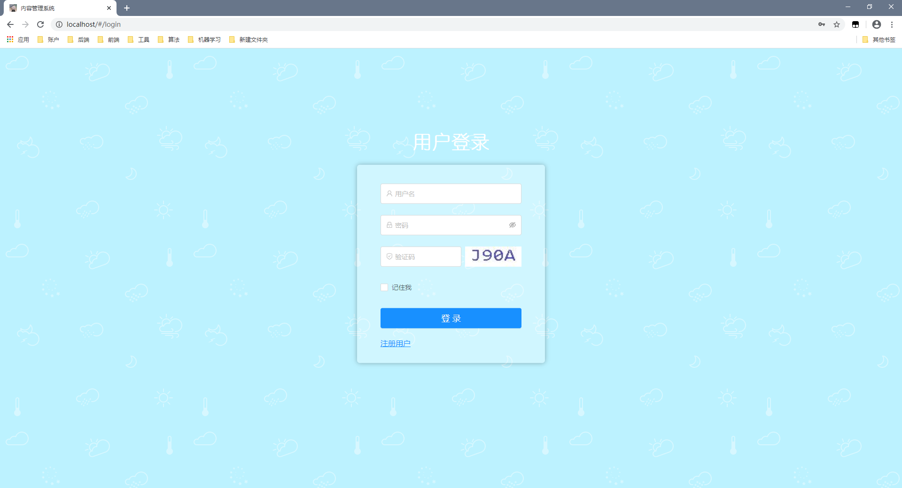
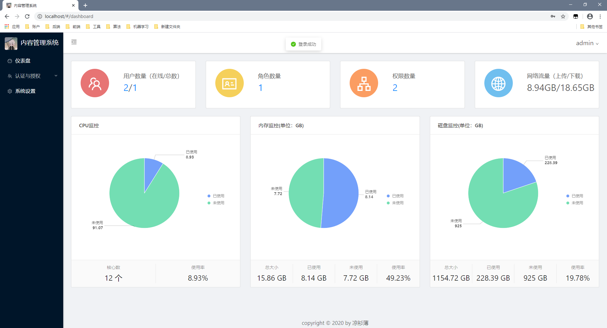
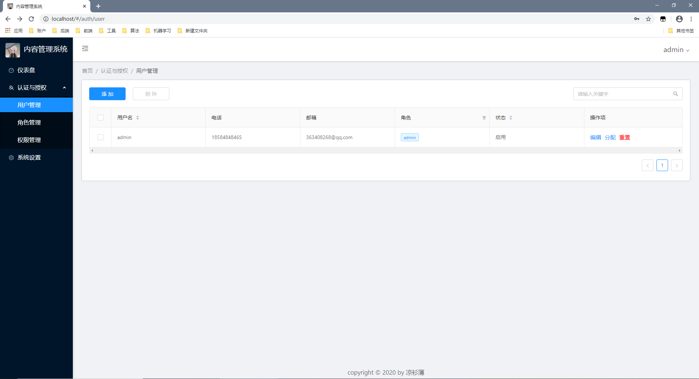
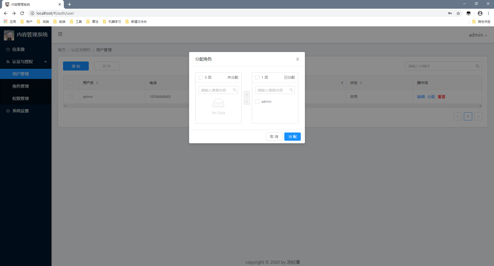
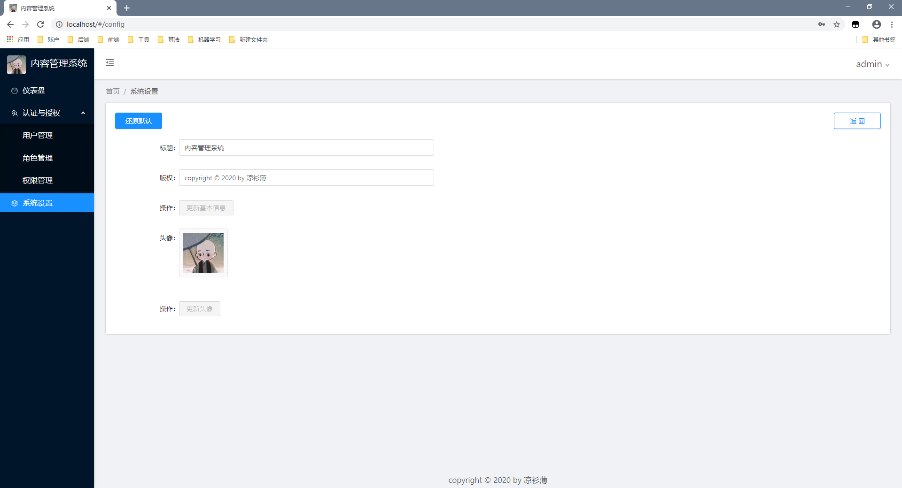
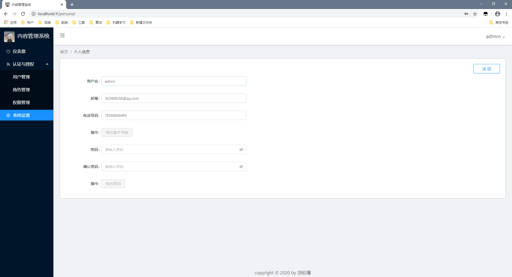

### 内容管理系统(后端工程)
[](https://github.com/wormhole/cms/releases)
[](https://github.com/stdutil/cms/network/members)
[](https://github.com/stdutil/cms/stargazers) 
[](https://github.com/wormhole/cms/archive/master.zip)
[](https://github.com/wormhole/cms/releases)
[](https://github.com/wormhole/cms/blob/master/LICENSE)

[内容管理系统(前端工程)传送门](https://github.com/wormhole/cms-front)

#### 一、如何运行
##### 1、打包
```$xslt
mvn package -Dmaven.javadoc.skip=true
```
##### 2、将`resources/lib`下的动态库放到`java.library.path`路径下面,运行以下代码可查看路径
```$xslt
String property = System.getProperty("java.library.path");
```

##### 3、运行
* Linux
```$xslt
nohup java -jar CMS.war > /dev/null &
```
* Windows
```$xslt
java -jar CMS.war
```

##### 4、使用
打开浏览器,输入`http://localhost`,超级管理员用户和密码为`admin`,`123456`

#### 二、项目结构
```$xslt
├─java
│  └─net
│      └─stackoverflow
│          └─cms
│              ├─common             (公共代码)
│              ├─config             (配置)
│              ├─constant           (常量类)
│              ├─dao                (数据库访问层)
│              ├─exception          (自定义异常类)
│              ├─model              
│              │  ├─entity          (实体类)
│              │  └─vo              (View Object)
│              ├─security           (Spring Security相关代码)
│              ├─service            (服务层代码）
│              ├─util               (工具类)
│              └─web                
│                  ├─controller     (业务层代码)
│                  │  ├─auth        (认证授权模块)
│                  │  ├─config      (系统设置模块)
│                  │  ├─dashboard   (仪表盘页面)
│                  │  └─personal    (个人详情页面)
│                  ├─filter         (过滤器)
│                  ├─interceptor    (拦截器)
│                  └─listener       (监听器)
└─resources                         
    ├─keystore                      (https key)
    ├─lib                           (sigar动态库)
    ├─mapper                        (Mybatis mapper文件)
    ├─sql                           (建库脚本)
    ├─static                        (静态文件,前端打包后放这)
    ├─templates                     (模板文件)
    ├─application.properties        (配置文件)
    └─logback.xml                   (logback日志配置)
```

#### 三、功能列表
- [x] 认证授权
    - [x] 用户注册
    - [x] 用户登录
    - [x] 验证码校验
    - [x] 用户管理
    - [x] 角色管理
    - [x] 权限管理
    
- [x] 仪表盘
    - [x] 在线用户统计
    - [x] 流量统计
    - [x] cpu监控
    - [x] 内存监控
    - [x] 磁盘监控
    
- [x] 系统设置
    - [x] 标题设置
    - [x] 版权设置
    - [x] 头像设置
    - [x] 还原默认配置

- [x] 个人信息
    - [x] 基本信息修改
    - [x] 密码修改
    
####  四、演示
##### 1、登录页


##### 2、仪表盘


##### 3、用户管理 (角色管理, 权限管理与之类似)


##### 4、角色分配 (权限分配与之类似)


##### 5、系统设置


##### 6、个人信息

